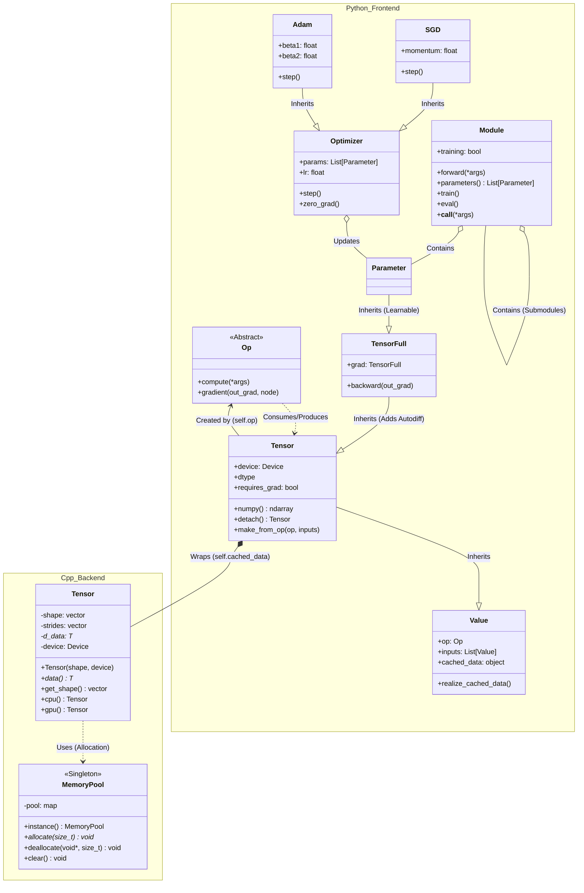
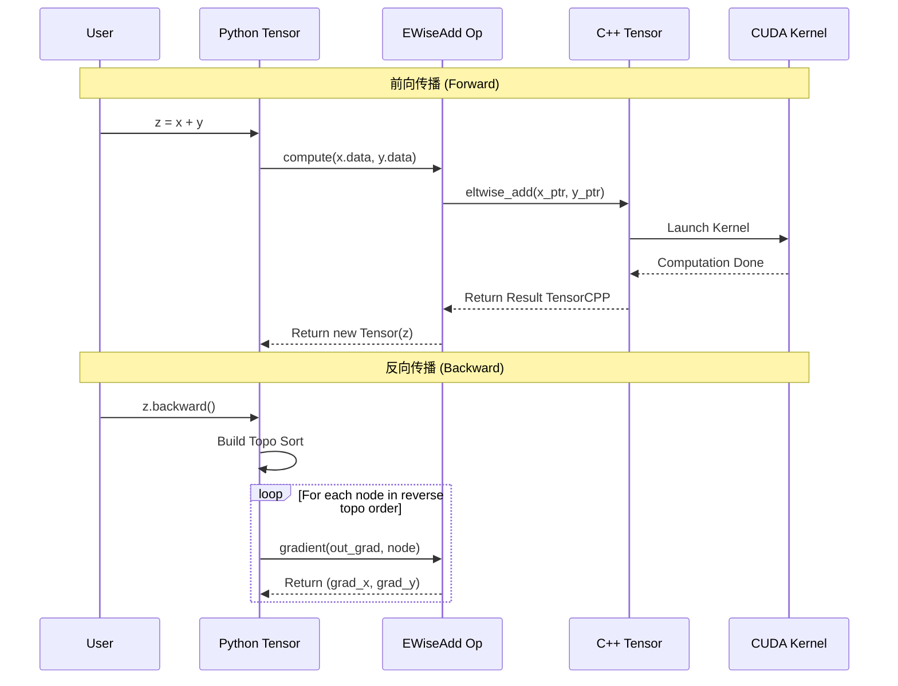

# 项目架构 UML 图

本文档展示了深度学习框架的核心类结构、关系以及数据流转机制。

## 核心类图 (Class Diagram)

```mermaid
classDiagram
    %% C++ Backend Namespace
    namespace Cpp_Backend {
        class MemoryPool {
            <<Singleton>>
            -pool: map
            +instance() MemoryPool
            +allocate(size_t) void*
            +deallocate(void*, size_t) void
            +clear() void
        }

        class TensorCPP["Tensor<T>"] {
            -shape: vector<int>
            -strides: vector<int>
            -d_data: T*
            -device: Device
            +Tensor(shape, device)
            +data() T*
            +get_shape() vector<int>
            +cpu() Tensor
            +gpu() Tensor
        }
    }

    %% Python Frontend Namespace
    namespace Python_Frontend {
        class Value {
            +op: Op
            +inputs: List[Value]
            +cached_data: object
            +realize_cached_data()
        }

        class Op {
            <<Abstract>>
            +compute(*args)
            +gradient(out_grad, node)
        }

        class TensorPy["Tensor"] {
            +device: Device
            +dtype
            +requires_grad: bool
            +numpy() ndarray
            +detach() Tensor
            +make_from_op(op, inputs)
        }

        class TensorFull {
            +grad: TensorFull
            +backward(out_grad)
        }

        class Parameter {
            %% Marker class for learnable weights
        }

        class Module {
            +training: bool
            +forward(*args)
            +parameters() List[Parameter]
            +train()
            +eval()
            +__call__(*args)
        }

        class Optimizer {
            +params: List[Parameter]
            +lr: float
            +step()
            +zero_grad()
        }
        
        class SGD {
            +momentum: float
            +step()
        }
        
        class Adam {
            +beta1: float
            +beta2: float
            +step()
        }
    }

    %% Relationships
    
    %% Backend relationships
    TensorCPP ..> MemoryPool : Uses (Allocation)
    
    %% Frontend inheritance
    TensorPy --|> Value : Inherits
    TensorFull --|> TensorPy : Inherits (Adds Autodiff)
    Parameter --|> TensorFull : Inherits (Learnable)
    SGD --|> Optimizer : Inherits
    Adam --|> Optimizer : Inherits

    %% Cross-language bridge
    TensorPy *-- TensorCPP : Wraps (self.cached_data)

    %% Computation Graph
    TensorPy --> Op : Created by (self.op)
    Op ..> TensorPy : Consumes/Produces

    %% Model Structure
    Module o-- Parameter : Contains
    Module o-- Module : Contains (Submodules)
    Optimizer o-- Parameter : Updates
```

## 核心流程交互图 (Sequence Diagram)

以下展示了 `z = x + y` 的前向传播与反向传播流程。

```mermaid
sequenceDiagram
    participant User
    participant TensorPy as Python Tensor
    participant Op as EWiseAdd Op
    participant TensorCPP as C++ Tensor
    participant CUDA as CUDA Kernel

    %% Forward Pass
    Note over User, CUDA: 前向传播 (Forward)
    User->>TensorPy: z = x + y
    TensorPy->>Op: compute(x.data, y.data)
    Op->>TensorCPP: eltwise_add(x_ptr, y_ptr)
    TensorCPP->>CUDA: Launch Kernel
    CUDA-->>TensorCPP: Computation Done
    TensorCPP-->>Op: Return Result TensorCPP
    Op-->>TensorPy: Return new Tensor(z)

    %% Backward Pass
    Note over User, CUDA: 反向传播 (Backward)
    User->>TensorPy: z.backward()
    TensorPy->>TensorPy: Build Topo Sort
    loop For each node in reverse topo order
        TensorPy->>Op: gradient(out_grad, node)
        Op-->>TensorPy: Return (grad_x, grad_y)
    end
```
